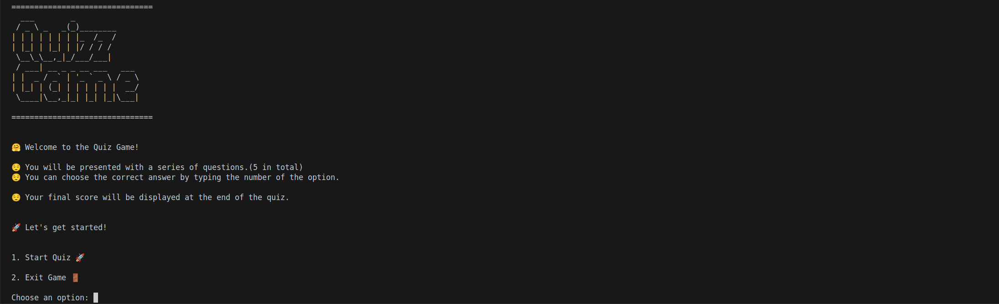

# Quiz Game



Welcome to the Quiz Game! This is a simple interactive terminal application where you can test your knowledge on various topics. It helps you practice JavaScript concepts such as arrays, loops, conditionals, objects, functions, and user input handling.

---

## Features

- Multiple choice questions
- Score tracking
- ASCII art for an enhanced user experience

---

## Getting Started

### Prerequisites

- Node.js (version 12 or higher)
- npm (Node Package Manager)

### Installation

1. Clone the repository to your local machine:

   ```bash
   git clone <CLONE LINK>
   ```

2. Navigate to the project directory:

   ```bash
   cd terminal-quiz
   ```

3. Install the required dependencies:

   ```bash
   npm install
   ```

### Running the Application

To start the Quiz Game, run the following command in your terminal:

```bash
npm start
```

### How to Play

1. The application will display a welcome message with ASCII art.
2. You will see a menu with the following options:
   - 1. Start Quiz
   - 2. Exit
3. Enter the number corresponding to your choice and follow the prompts.
4. If you choose to start the quiz, you will be presented with a series of multiple-choice questions.
5. Enter the number corresponding to your answer for each question.
6. At the end of the quiz, your score will be displayed.

### Example

```bash
===============================
  ___        _
 / _ \ _   _(_)________
| | | | | | | |_  /_  /
| |_| | |_| | |/ / / /
 \__\_\__,_|_/___/___|
 / ___| __ _ _ __ ___   ___
| |  _ / _` | '_ ` _ \ / _ \
| |_| | (_| | | | | | |  __/
 \____|\__,_|_| |_| |_|\___|

===============================


🤗 Welcome to the Quiz Game!

😌 You will be presented with a series of questions.(5 in total)
😌 You can choose the correct answer by typing the number of the option.

😌 Your final score will be displayed at the end of the quiz.


🚀 Let's get started!


1. Start Quiz 🚀

2. Exit Game 🚪

Choose an option: 1

🤔 What is the capital of France?
1. Berlin
2. Madrid
3. Paris
4. Rome
------------------------------
🤔 Your answer: 3

******************************
🙂 Correct!
******************************

🤔 Which planet is known as the Red Planet?
1. Earth
2. Mars
3. Jupiter
4. Venus
------------------------------
🤔 Your answer:
```

## Code Explanation

The code is written in JavaScript using modern ES6+ syntax. The `readline-sync` package is used to handle user input in the terminal. Here's a brief overview of the main parts of the code:

- **Importing readline-sync**: The `readline-sync` module is imported using ES6 `import` syntax.
- **ASCII Art**: The `appTitle` constant contains the ASCII art for the application title.
- **Quiz Questions**: The `quizQuestions` array contains objects representing each quiz question. Each object has a `question`, `options`, and `answer`.
- **Menu Display**: The `showMenu` function displays the main menu options.
- **Quiz Logic**:
  - `startQuiz` function iterates over the `quizQuestions` array, displays each question and its options, prompts the user for an answer, checks if the answer is correct, and updates the score.
  - `startQuizGame` function contains the main loop that runs the application, displaying the menu and handling user input based on their choices.

## Contributing

Contributions are welcome!
If you have any ideas for improvements or new features, feel free to fork the repository and submit a pull request.

## License

This project is licensed under the MIT License.

---

Enjoy playing the Quiz Game!
If you have any questions or need further assistance, feel free to reach out.
